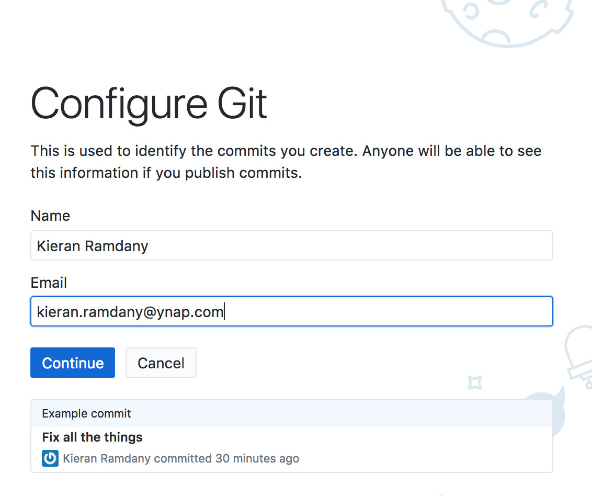
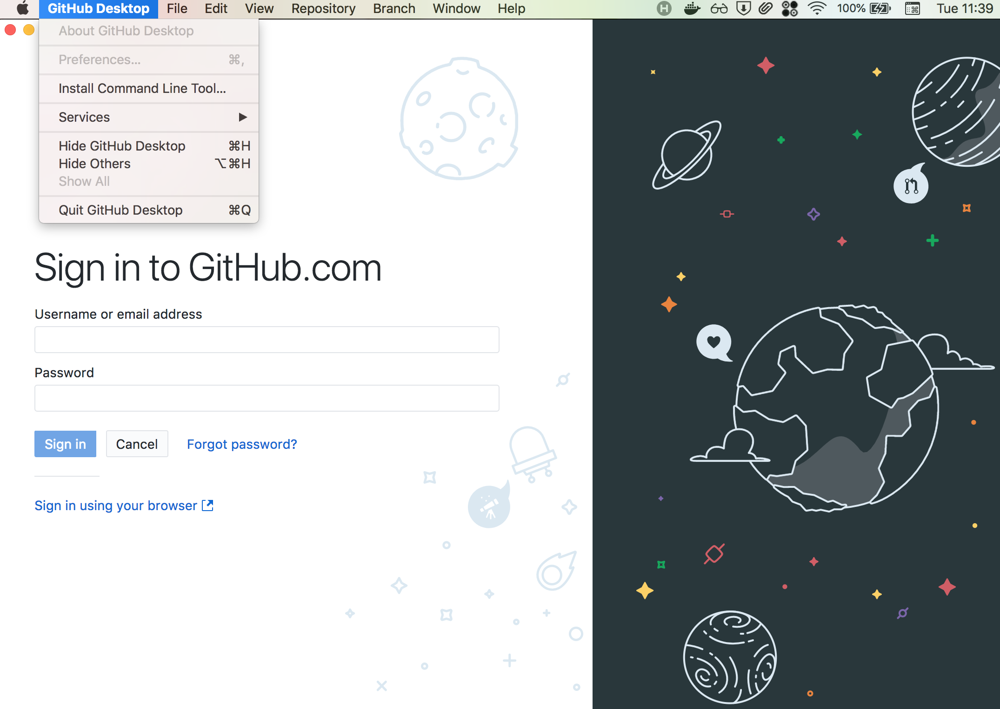
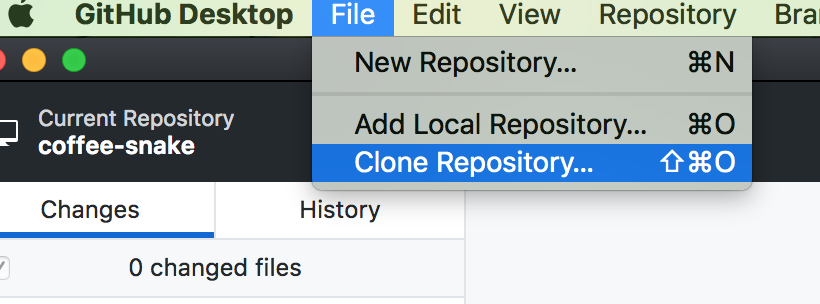
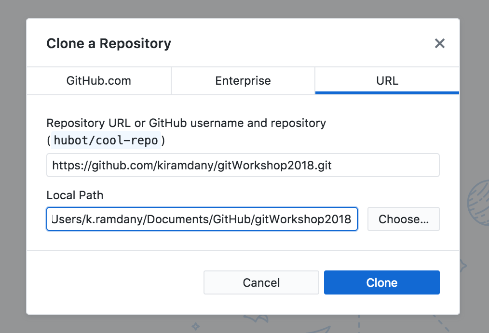
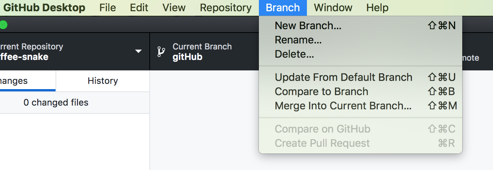
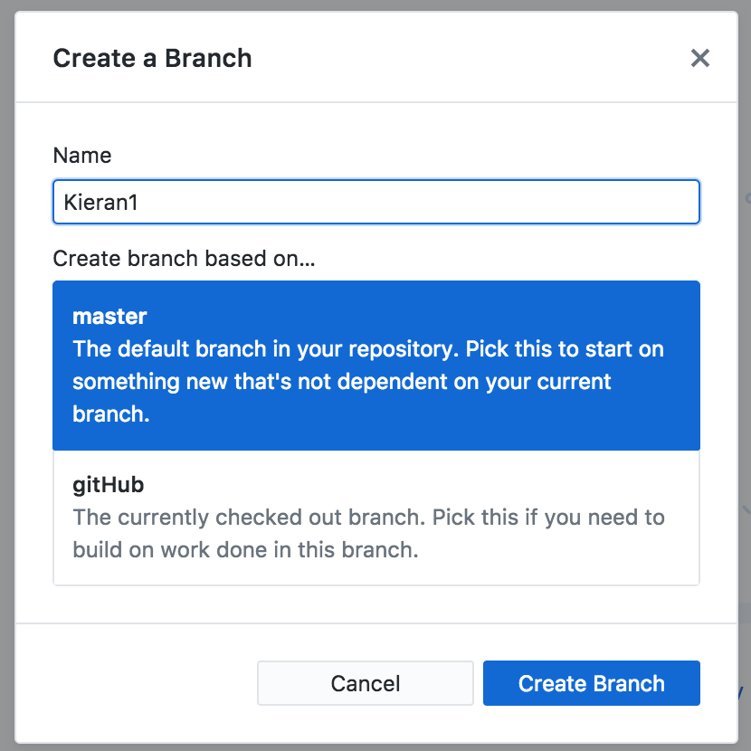
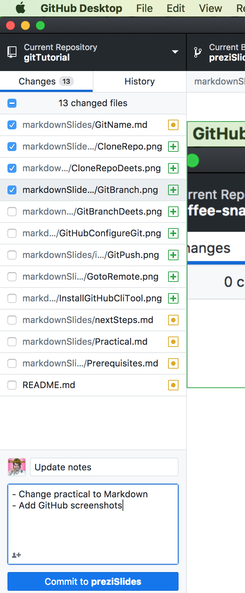
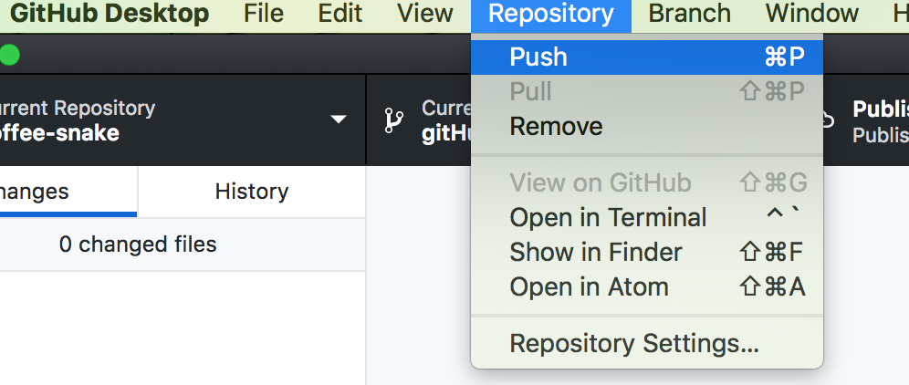
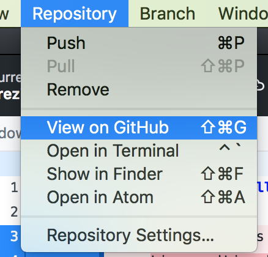

## People Directory

-   Will post helpful information in [gitter](https://gitter.im/cliTutorialNotes/Lobby)
-   I encourage you to ask questions in there as well
-   You have the choice to follow the practical using either the Command Line or a GUI program ( GitHub Desktop )
-   The images will be screenshots of the relevant action in GitHub Desktop
-   Anything with grey background can be run from the "Terminal" application
-   If you get stuck with the command line and want to switch to using the GUI,
    -   `open .` to view your files in finder
    -   `github .` to use GitHub Desktop

### Initial Setup

To start using git you need to set a user name and an email
You'll only have to do this once

```
git config --global user.email "your.name@ynap.com"
git config --global user.name "Your Name"
```



Install the command line tool for GitHub Desktop ( regardless if you'll be using it now )


### Getting Started

Copy my code from GitHub

#### How?

```
git clone {repo url}
```

Remember to go into this new folder that you have copied ( git unfortunately doesn't do that for you )




#### And then?

Switch to a new branch

```
git checkout -b {your name}
```




### Markdown

We're going to use markdown to quickly create a bio pages for ourselves

Markdown is a quick and basic way to format text that can create webpages.

-   These tutorial notes for example are written in markdown for example
-   Standard things such as different size titles, lists, tables, images, code formatting is supported
-   Quick reference to syntax [here](https://github.com/adam-p/markdown-here/wiki/Markdown-Cheatsheet)
-   Markdown files end with `.md`
-   Can view on google chrome using the markdown viewer extension `open -a "Google Chrome" {filename}`

Remember that the point is to practice git not to learn markdown or to make these pages look pretty, so don't worry too much about that part

#### Create Bio Page

-   Make a new file naming it `{your-name}.md`
-   Add some basic information
-   You're welcome to include a picture as well

### Share your changes

```
git status
git add .
git status      #always a good check
git commit


git push
git branch --set-upstream-to origin/{branchName}
git push
```





Create Pull Request



### Link to your Bio

Edit the `README.md` file and add a link to your bio page

Again any time you start new file create a new branch off `master`

However you may find that your bio page disappears when you do This

Check out the section below

### Update your copy with changes from the remote

When your Pull Request is merged this change only happens on the remote copy of the repository

Now that the files on the `master` branch in GitHub have been updated we'll need to get a copy of those changes locally

```
git checkout master
git pull
```

and now you can create a new branch off master to add the link to your bio page in the `README.md` file

| [Next](nextSteps.md) | [Home](index.md) |
| -------------------- | ---------------- |
