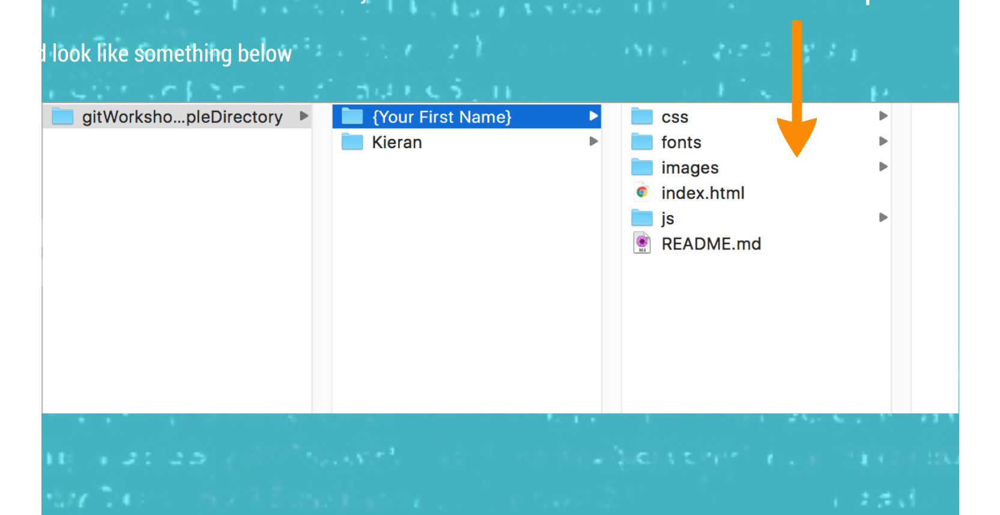

## People Directory

-   Will post helpful information in slack
-   I encourage you to ask questions in there as well
-   Anything with grey background can be run from the "Terminal" or "iTerm" application

### Initial Setup

To start using git you need to set a user name and an email
You'll only have to do this once

```
git config --global user.email "your.name@ynap.com"
git config --global user.name "Your Name"
```

Example of why ...

http://stash.vm.wtf.nap:7990/projects/MRP/repos/mrp-productlist/commits?until=refs%2Fheads%2FISP-642

You'll see that I used a different email locally (my personal email) but when merging in stuff Stash wrote the commit with the email I was logged in with (work email)
Using the same email as is on stash/github allows it to link to your profile and include your avatar pic

### Getting Started

Copy my code from Stash

#### How?

```
git clone {repo url}
```

Remember to go into this new folder that you have copied ( git unfortunately doesn't do that for you )

#### And then?

Switch to a new branch

```
git checkout -b {your name}
```

### HTML Templates

Find a html template that you like on the website below

-   https://freebiesbug.com/code-stuff/html-website-templates/

I have chosen a few, if you want to try one of the following

-   https://freebiesbug.com/code-stuff/bicycle-flat-html5-css3-template/
-   https://freebiesbug.com/code-stuff/nevada-html-template/
-   https://freebiesbug.com/code-stuff/oak-html-portfolio-template/
-   https://freebiesbug.com/code-stuff/bodo-free-html-personal-portfolio-template/
-   https://freebiesbug.com/code-stuff/resume-template-psd-html/
-   https://freebiesbug.com/code-stuff/elegant-free-html-psd-portfolio-template/
-   https://tympanus.net/codrops/2013/02/26/elastic-content-slider/
-   https://tympanus.net/codrops/2013/07/18/on-scroll-effect-layout/

#### Download

-   Download the files of the template you like
-   Make a folder named with your first name in the project
-   Copy all the files from the download into your folder
-   Should look like something below


These are the files from inside the downloaded template

#### Edit the index.html file and fill in your details

-   This could be different depending on how the files are structured
-   View the template in Chrome and search for the text you see on screen in the code. That will point you in the right direction
-   And of course do ask for help if stuck

### Share your changes

```
git status
git add .
git status      #always a good check
git commit


git push
git branch --set-upstream-to origin/{branchName}
git push
```

Create Pull Request

| [Next](nextSteps.md) | [Home](index.md) |
| -------------------- | ---------------- |

