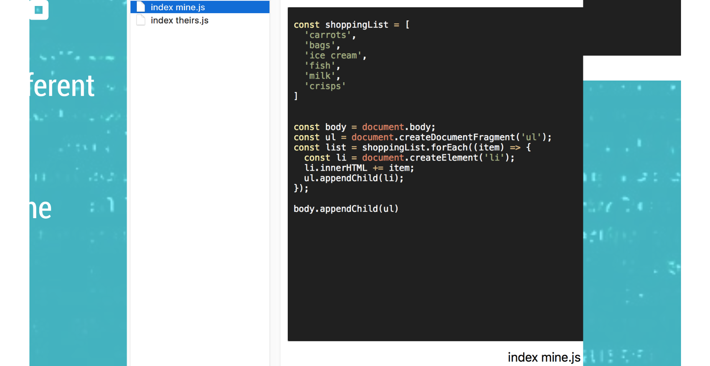

## Problem

### Premise of the Problem

-   Sometimes we break our code :(
-   We also need an easy way to share code
-   And this shared code needs to be easy to collaborate on

### Versioning

Version numbers on files

This quickly becomes a pain

### Sharing

Emailing Team Members your changes

-   Could also use something like Google Drive or Dropbox
-   But also worthwhile that you can attach a message to your changes

I think you can already tell how this can easily become a mess

### Collaborating

Combining changes

-   Team members can have different versions of the same file
-   Have to combine them
-   This is a very manual and time consuming process

### What we need

We need something that

-   Takes care of versioning
-   Can compare these versions
-   Provides a convenient way of sharing
-   Can put together different versions of the same file

| [Next](Solution.md) | [Home](index.md) |
| ------------------- | ---------------- |

