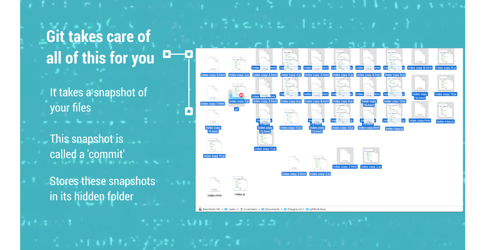
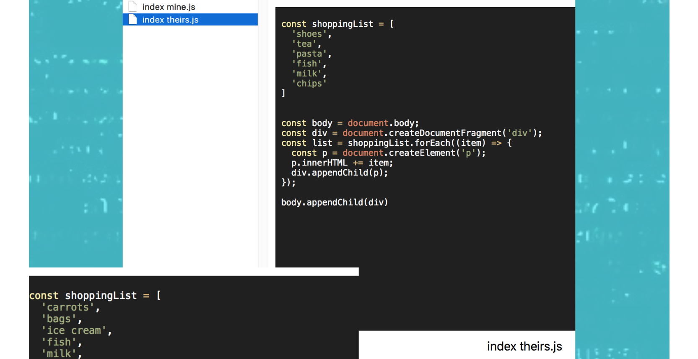

## Solution
This is where Git comes in

### Versioning

Git takes care of all of this for you

-   It takes a snapshot of your files
-   This snapshot is called a 'commit'
-   Stores these snapshots in its hidden folder

### Comparing

Git provides a really easy way to compare versions files and folders

### Sharing

Store on the Internet

-   Put our files somewhere that is accessible
-   Git provides an easy way to put our changes up to the accessible space
-   Team mates can get a copy of the files for themselves to work on
-   They can put up their changes also

### Collaborating

Combining changes

Git can combine changes automatically

| [Next](Practical.md) | [Home](index.md) |
| -------------------- | ---------------- |

